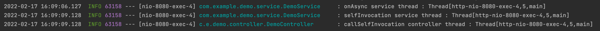

# Async
비동기 처리 데모 프로젝트

## Note
### @EnableAsync
- spring bean에 사용 된 `@Async` annotation 감지를 활성화한다.

### @Async
- proxy 패턴 기반의 AOP 방식으로 동작하기때문에 public 메서드에서만 동작한다.
- 제약조건 : 아래의 경우에는 proxy가 아닌 메서드를 직접 호출하기 떄문에 동작하지 않는다.
  - self invocation(동일 클래스 내부의 메서드 호출)
  - private method 호출
  

## Demo
### callAsync
- demo thread 동작

### callSync
- main thread 동작

### callSelfInvocation
- main thread 동작

## References
- https://jeong-pro.tistory.com/187
- https://www.hanumoka.net/2020/07/02/springBoot-20200702-sringboot-async-service
- https://springboot.tistory.com/38
